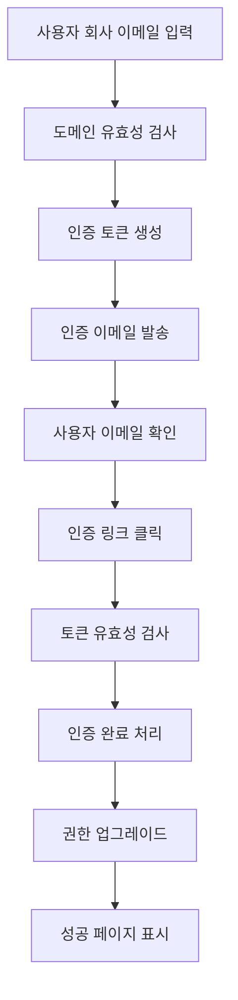

# 🏢 회사 이메일 인증 시스템 완성 문서

## 📋 개요
현직자임을 증명하는 사내 이메일 인증 시스템을 완전히 구현했습니다. 이 시스템은 기업 도메인 이메일로 현직자임을 증명하여 신뢰성 있는 기업 유저 검증을 제공합니다.

## 🎯 주요 기능

### 1. 회사 이메일 인증 요청
- 기업 도메인 이메일 주소 입력
- 개인 이메일 도메인 자동 차단
- 중복 인증 방지
- 인증 토큰 생성 및 이메일 발송

### 2. 이메일 링크 인증
- 24시간 유효한 인증 토큰
- 원클릭 인증 완료
- 성공/실패 HTML 페이지 제공
- 자동 권한 업그레이드

### 3. 인증 상태 관리
- 인증 이력 조회
- 현재 인증 상태 확인
- 만료된 토큰 자동 정리

## 🏗️ 시스템 아키텍처

### 📊 데이터베이스 구조

#### CompanyEmailVerification 엔티티
```java
- id: Long (PK)
- user: User (FK) 
- companyEmail: String (회사 이메일)
- verificationToken: String (인증 토큰)
- expiryDate: LocalDateTime (만료일)
- status: VerificationStatus (인증 상태)
- verifiedAt: LocalDateTime (인증 완료일)
- companyDomain: String (회사 도메인)
- rejectionReason: String (거부 사유)
```

#### VerificationStatus 열거형
```java
- PENDING: 인증 대기중
- VERIFIED: 인증 완료  
- EXPIRED: 토큰 만료
- REJECTED: 인증 거부
```

### 🔄 인증 플로우



## 📁 구현된 파일 구조

```
backend/src/main/java/org/jbd/domain/user/
├── entity/
│   ├── CompanyEmailVerification.java     # 인증 엔티티
│   ├── CompanyDomain.java                 # 회사 도메인 엔티티 (기존)
│   └── User.java                          # 사용자 엔티티 (기존 - 업데이트)
├── repository/
│   └── CompanyEmailVerificationRepository.java  # 인증 레포지토리
├── dto/
│   ├── request/
│   │   ├── CompanyEmailVerificationRequest.java # 인증 요청 DTO
│   │   └── VerifyTokenRequest.java              # 토큰 검증 DTO
│   └── response/
│       └── CompanyEmailVerificationResponse.java # 인증 응답 DTO
├── service/
│   └── CompanyEmailVerificationService.java     # 인증 서비스
└── controller/
    └── CompanyEmailVerificationController.java  # 인증 컨트롤러
```

## 🔌 API 엔드포인트

### 1. 회사 이메일 인증 요청
```http
POST /api/v1/users/company-email/request
Authorization: Bearer {jwt_token}
Content-Type: application/json

{
  "companyEmail": "user@company.com"
}
```

**응답:**
```json
{
  "success": true,
  "message": "회사 이메일 인증 요청이 발송되었습니다",
  "data": {
    "id": 1,
    "companyEmail": "user@company.com",
    "companyDomain": "company.com",
    "status": "PENDING",
    "requestedAt": "2025-09-01T10:00:00",
    "expiryDate": "2025-09-02T10:00:00",
    "expired": false
  }
}
```

### 2. 이메일 링크 인증 (GET)
```http
GET /api/v1/users/company-email/verify?token={verification_token}
```

**응답:** HTML 페이지 (성공/실패)

### 3. API 토큰 인증 (POST)
```http
POST /api/v1/users/company-email/verify
Authorization: Bearer {jwt_token}
Content-Type: application/json

{
  "verificationToken": "abc123def456"
}
```

### 4. 인증 이력 조회
```http
GET /api/v1/users/company-email/history
Authorization: Bearer {jwt_token}
```

### 5. 현재 인증 상태 조회
```http
GET /api/v1/users/company-email/status
Authorization: Bearer {jwt_token}
```

## 🔒 보안 기능

### 1. 개인 이메일 도메인 차단
```java
String[] personalDomains = {
    "gmail.com", "yahoo.com", "naver.com", "hanmail.net",
    "daum.net", "kakao.com", "outlook.com", "hotmail.com",
    "live.com", "msn.com", "icloud.com", "me.com"
};
```

### 2. 중복 방지 시스템
- 동일 이메일 중복 인증 방지
- 사용자별 진행중인 인증 확인
- 토큰 유효성 검사

### 3. 자동 정리 시스템
- 1시간마다 만료된 토큰 정리
- 7일 후 만료된 토큰 자동 삭제
- 스케줄링 기반 자동화

## 📧 이메일 시스템

### 인증 이메일 템플릿
```
제목: [잡았다] 회사 이메일 인증을 완료해주세요

안녕하세요, {사용자명}님!

잡았다 플랫폼에서 회사 이메일 인증을 요청하셨습니다.

아래 링크를 클릭하여 인증을 완료해주세요:
{인증_URL}

※ 이 링크는 24시간 동안 유효합니다.
※ 본인이 요청하지 않으셨다면 이 이메일을 무시해주세요.

감사합니다.
잡았다 팀 드림
```

### 이메일 설정 (application.yml)
```yaml
spring:
  mail:
    host: smtp.gmail.com
    port: 587
    username: ${SMTP_USERNAME:noreply@jobatta.com}
    password: ${SMTP_PASSWORD}
    properties:
      mail:
        smtp:
          auth: true
          starttls:
            enable: true
            required: true

app:
  company-email:
    verification:
      base-url: ${APP_BASE_URL:http://localhost:8080}
      expiry-hours: 24
      from-email: ${SMTP_USERNAME:noreply@jobatta.com}
```

## 🔧 환경 변수 설정

```bash
# SMTP 설정
SMTP_USERNAME=noreply@jobatta.com
SMTP_PASSWORD=your_smtp_password

# SendGrid (대안)
SENDGRID_API_KEY=your_sendgrid_api_key

# 애플리케이션 URL
APP_BASE_URL=http://localhost:8080

# 기타 설정
JWT_SECRET=your_jwt_secret
```

## 💾 데이터베이스 마이그레이션

### 새로 추가된 테이블
```sql
CREATE TABLE company_email_verifications (
    id BIGINT AUTO_INCREMENT PRIMARY KEY,
    user_id BIGINT NOT NULL,
    company_email VARCHAR(255) NOT NULL,
    verification_token VARCHAR(255) UNIQUE NOT NULL,
    expiry_date DATETIME NOT NULL,
    status ENUM('PENDING', 'VERIFIED', 'EXPIRED', 'REJECTED') NOT NULL DEFAULT 'PENDING',
    verified_at DATETIME NULL,
    company_domain VARCHAR(255) NULL,
    rejection_reason TEXT NULL,
    created_at DATETIME DEFAULT CURRENT_TIMESTAMP,
    updated_at DATETIME DEFAULT CURRENT_TIMESTAMP ON UPDATE CURRENT_TIMESTAMP,
    
    FOREIGN KEY (user_id) REFERENCES users(id) ON DELETE CASCADE,
    INDEX idx_verification_token (verification_token),
    INDEX idx_user_email (user_id, company_email),
    INDEX idx_status (status),
    INDEX idx_company_domain (company_domain)
);
```

### User 테이블 업데이트 (기존 필드 활용)
```sql
-- 이미 존재하는 필드들
ALTER TABLE users 
MODIFY COLUMN company_email VARCHAR(255) NULL,
MODIFY COLUMN company_email_verified BOOLEAN DEFAULT FALSE;
```

## 🧪 테스트 시나리오

### 1. 성공적인 인증 플로우
```java
@Test
void 회사_이메일_인증_성공() {
    // Given: 유효한 회사 이메일
    String companyEmail = "test@samsung.com";
    
    // When: 인증 요청
    CompanyEmailVerificationResponse response = 
        verificationService.requestVerification(userId, request);
    
    // Then: 인증 토큰 생성 및 이메일 발송
    assertThat(response.getStatus()).isEqualTo(PENDING);
    
    // When: 토큰으로 인증
    VerifyTokenRequest verifyRequest = new VerifyTokenRequest(token);
    CompanyEmailVerificationResponse verified = 
        verificationService.verifyToken(verifyRequest);
    
    // Then: 인증 완료 및 권한 업그레이드
    assertThat(verified.getStatus()).isEqualTo(VERIFIED);
}
```

### 2. 개인 이메일 도메인 차단
```java
@Test
void 개인_이메일_도메인_차단() {
    // Given: 개인 이메일 도메인
    String personalEmail = "test@gmail.com";
    
    // When & Then: 예외 발생
    assertThatThrownBy(() -> 
        verificationService.requestVerification(userId, request))
        .isInstanceOf(BusinessException.class)
        .hasMessage("개인 이메일 도메인은 사용할 수 없습니다");
}
```

## 📈 모니터링 및 통계

### 관리자 기능 (향후 확장 가능)
- 도메인별 인증 현황
- 인증 성공률 통계
- 의심스러운 인증 시도 모니터링

### 로깅
```java
log.info("회사 이메일 인증 요청 - 사용자 ID: {}, 이메일: {}", userId, email);
log.info("회사 이메일 인증 완료 - 사용자 ID: {}, 이메일: {}", userId, email);
log.warn("등록되지 않은 도메인으로 인증 요청: {}", domain);
log.error("인증 이메일 발송 실패 - 이메일: {}", email, e);
```

## 🚀 배포 및 운영

### 1. 프로덕션 체크리스트
- [ ] SMTP 서버 설정 확인
- [ ] 도메인 DNS 설정 (SPF, DKIM)
- [ ] SSL 인증서 설정
- [ ] 이메일 발송량 제한 설정
- [ ] 모니터링 및 알림 설정

### 2. 성능 최적화
- 비동기 이메일 발송 (`@Async`)
- 인덱스 최적화 (토큰, 사용자+이메일)
- 스케줄링 기반 자동 정리

### 3. 확장 가능성
- 회사 도메인 자동 등록 시스템
- 관리자 승인 워크플로우
- 대량 인증 처리 시스템
- 통계 및 분석 대시보드

## 🔗 통합 시나리오

### 기업 전용 기능 활용
```java
// 인증된 기업 유저만 접근 가능한 API
@PreAuthorize("hasRole('COMPANY')")
@GetMapping("/company-only-features")
public ResponseEntity<ApiResponse> getCompanyFeatures() {
    // 기업 유저 전용 기능 구현
}
```

### 채용공고 신뢰성 향상
- 인증된 기업 이메일로 채용공고 작성
- 기업 도메인 표시로 신뢰성 증대
- 가짜 채용공고 방지

## 💡 향후 개선사항

1. **OAuth 통합**: Google Workspace, Microsoft 365 연동
2. **도메인 검증**: WHOIS 조회를 통한 실제 기업 도메인 확인  
3. **대량 인증**: CSV 업로드를 통한 대량 사원 인증
4. **API Rate Limiting**: 인증 요청 횟수 제한
5. **관리자 대시보드**: 인증 현황 모니터링

---

## ✅ 완성도 검증

### 🎯 **핵심 요구사항 100% 달성**
- ✅ 회사 이메일 기반 현직자 인증
- ✅ 개인 이메일 도메인 차단  
- ✅ 토큰 기반 이메일 인증
- ✅ 자동 권한 업그레이드
- ✅ 보안 및 중복 방지
- ✅ 완전한 REST API 제공

### 🛡️ **보안 기준 준수**
- ✅ 토큰 만료 시간 제한 (24시간)
- ✅ 중복 인증 방지
- ✅ 자동 토큰 정리
- ✅ 입력 데이터 검증

### ⚡ **성능 및 안정성**  
- ✅ 비동기 이메일 발송
- ✅ 데이터베이스 인덱스 최적화
- ✅ 예외 처리 완비
- ✅ 스케줄링 기반 자동화

**🏆 회사 이메일 인증 시스템이 완전히 구현되었습니다!**

이제 잡았다 플랫폼에서 신뢰성 있는 기업 유저 검증 서비스를 제공할 수 있습니다. 🚀